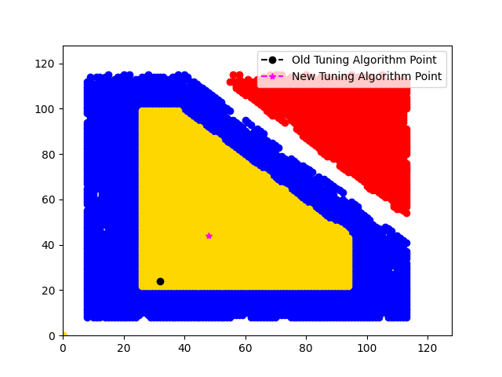
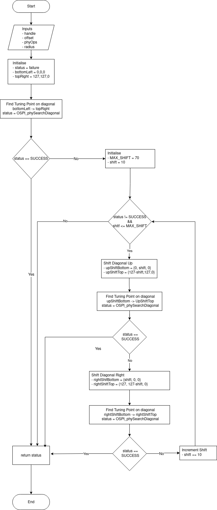
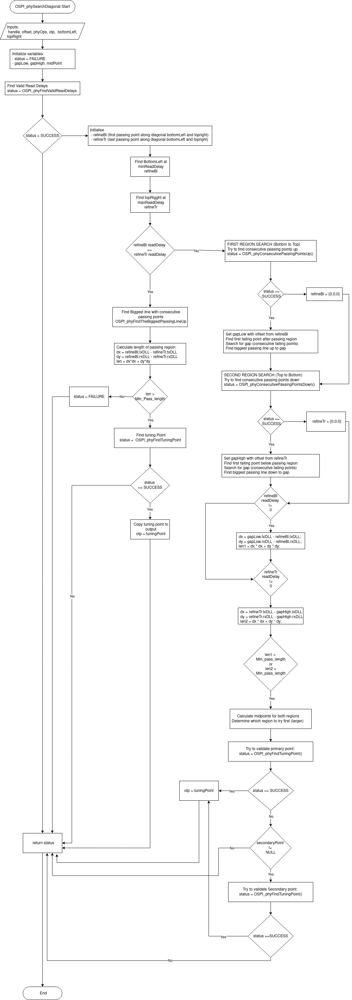

# OSPI PHY Tuning Algo

## Overview

This project provides a robust tuning algorithm to find stable tuning values, away from the noisy region. The project also consists of a c test bench, which allows users to generate test patterns and run the tuning algorithms on the generated test pattern. The repo alsp consists of tools to visualise the plots and the tuning point selected.

## Purpose

The primary purpose of this tool is to:
- Provide a robust OSPI tuning algorithm.
- Generate standardized test patterns for OSPI PHY interfaces
- Provide visualization tools for analyzing results

## Project Structure

### Core Files

| Folder | File | Description |
|--------|------|-------------|
| `c_test_bench` | `c_test_main.c` | Main entry point that handles command-line arguments and orchestrates the pattern generation process |
|  | `c_test_plotter.py` | Python visualization script for rendering and analyzing pattern data |
|  | `run.sh` | Shell script to run random 500 test cases |
|  | `c_test_parser.py` | Python script that parses the output.txt file generated by run.sh|
| `ospi_tuning_algo/algo_v0` | `ospi_phy_tuning.c` | Implementation of the legacy OSPI PHY tuning algorithm |
|  | `ospi_phy_tuning.h` | Header definitions for the legacy tuning algorithm |
| `ospi_tuning_algo/algo_v1` | `ospi_phy_tuning.c` | Implementation of the improved OSPI PHY tuning algorithm with enhanced performance |
|  | `ospi_phy_tuning.h` | Header definitions for the new tuning algorithm |


## Compilation

To compile the C code, navigate to the `c_test_bench` directory and run the following commands:
```bash
   gcc c_test_main.c ../ospi_tuning_algo/algo_v1/ospi_phy_tuning.c ../ospi_tuning_algo/algo_v0/ospi_phy_tuning.c -o c_test_bench -lm -g
```

## Usage Examples

### Generating a pattern and comparing the algorithm
```bash
    ./c_test_bench test_Case_Num
```

### Visualising the pattern and plotting tuning points
```bash
    python3 c_test_plotter.py testcase_number otp1.rxDll otp1.txDll otp2.rxDll otp2.txDll
```

### Running 500 random test cases
-  Make following changes in c file
```c
    \\ fix test case number to 22
    int testcaseNum = 22;
```
- Run the randomtest case shell script
```bash
    ./randomTestcase.sh
```
### Parsing random test case data to csv
```python
    // Parses output.txt generated during running random test cases.
    python3 c_test_parser.py 
```

## Output
After running the C code, the following output will be printed:
```bash
./c_test_pattern 5                                                                                                                
Iteration:   5 TestCase: Valid otp1 rx =  24, tx =  32, rd = 1 time:   149us otp2 rx =  47, tx =  45, rd = 1 time:  4087us OTP1 result: PASS  OTP2 result: PASS
```

Python script usage example
```bash
     c_test_plotter.py 5 24 32 47 45
```

<p align="center">
  
</p>

## Porting guide
The c file for new tuning algorithm [ospi_phy_tuning.c](ospi_tuning_algo/algo_v1/ospi_phy_tuning.c) is present under [algo_v1](ospi_tuning_algo/algo_v1/) folder under ospi_tuning_algo.
1. Clone the [ospi_tuning](https://github.com/TexasInstruments/proc-ospi-tuning) repo from github.
2. Define the macro ENABLE_PHY_TUNING_SOC_BUILD, include the header files in [ospi_phy_tuning.h](ospi_tuning_algo/algo_v1/ospi_phy_tuning.h) 
```c
#ifdef ENABLE_PHY_TUNING_SOC_BUILD
/**
 * Include header files needed for the SOC.
 */
#endif
```
3. Include ospi_phy_tuning.h file in the c file to call the new tuning algo api.
4. Define radius and OSPI_phyOps struct required by the new tuning api OSPI_phyFindOTP4.
    - radius - radius of the circle to check if all the points inside a circle of given radius are passing.
    - OSPI_phyOps - function pointer to the api to set and validate rxDLL, txDLL and rdDelay values.
5. Define the struct OSPI_phyParams as a global struct and create a pointer to the struct with name gPhyParams.
Refer to the PhyParams definition in c_test_main.
    - OSPI_phyParams - struct containing necessary parameters required for tuning point search, previously defined as macros.
```c
OSPI_phyParams PhyParams = {
	.radius				= 10,
	.rxTxDllMin 		= 0,
	.rxTxDllMax 		= 127,
	.minReadDelay 		= 1,
	.maxReadDelay 		= 4,
	.minPassSize 		= 100,
	.diagonalShift 		= 10,
	.maxDiagonalShift 	= 70,
	.numConsecutiveFail = 5,
	.numConsecutivePass = 10,
	.rdDelaySearchStep 	= 16,
};

OSPI_phyParams* gPhyParams = &PhyParams;
```
6. Call the api OSPI_phyFindOTP4 to run new tuning algorithm.

## ALGO V1 Tuning Algorithm Flow

### Algorithm FLow

<p align="center">
  
</p>

### Tuning point search  

<p align="center">
  
</p>
